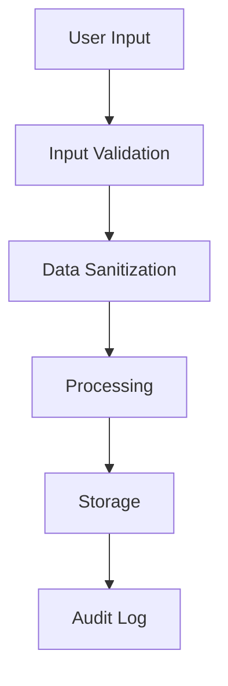

# Data Privacy Requirements

## Overview

This document outlines the data privacy and security requirements for the Psychiatry Chatbot system, ensuring compliance with healthcare data protection standards and regulations.

## Regulatory Compliance

### HIPAA Compliance
1. **Protected Health Information (PHI)**
   - No storage of patient-specific information
   - No collection of medical history
   - No personal health data processing
   - No clinical decision support
   - No patient records integration

2. **Security Requirements**
   - End-to-end encryption
   - Access controls
   - Audit logging
   - Data backup
   - Incident response plan

3. **Administrative Safeguards**
   - Security policies
   - Risk assessment
   - Workforce training
   - Business associate agreements
   - Compliance monitoring

### GDPR Compliance
1. **Data Protection**
   - Data minimization
   - Purpose limitation
   - Storage limitation
   - Integrity and confidentiality
   - Accountability

2. **User Rights**
   - Right to access
   - Right to rectification
   - Right to erasure
   - Right to restrict processing
   - Right to data portability

3. **Legal Basis**
   - User consent
   - Legitimate interests
   - Contract performance
   - Legal obligations
   - Vital interests

## Data Handling

### Data Collection
1. **User Data**
   ```typescript
   interface UserData {
     id: string;
     email: string;
     created_at: Date;
     last_login: Date;
     preferences: {
       theme: 'light' | 'dark';
       notifications: boolean;
       language: string;
     };
     metadata: Record<string, any>;
   }
   ```

2. **Chat Data**
   ```typescript
   interface ChatData {
     session_id: string;
     user_id: string;
     messages: Array<{
       id: string;
       role: 'user' | 'assistant';
       content: string;
       timestamp: Date;
       references: Array<{
         type: 'article' | 'course';
         id: string;
         title: string;
       }>;
     }>;
     metadata: Record<string, any>;
   }
   ```

3. **Analytics Data**
   ```typescript
   interface AnalyticsData {
     event_type: string;
     user_id: string;
     timestamp: Date;
     session_id: string;
     metadata: {
       browser: string;
       device: string;
       location: string;
       duration: number;
     };
   }
   ```

### Data Storage
1. **Database Security**
   ```sql
   -- Row Level Security Policies
   CREATE POLICY "Users can only access their own data"
   ON public.users
   FOR ALL
   USING (auth.uid() = id);

   CREATE POLICY "Users can only access their own chat sessions"
   ON public.chat_sessions
   FOR ALL
   USING (auth.uid() = user_id);
   ```

2. **Encryption**
   ```typescript
   interface EncryptionConfig {
     algorithm: 'AES-256-GCM';
     keyRotation: number; // days
     backupEnabled: boolean;
     keyManagement: 'AWS KMS' | 'GCP KMS';
   }
   ```

3. **Backup Strategy**
   ```typescript
   interface BackupConfig {
     frequency: 'daily' | 'weekly' | 'monthly';
     retention: number; // days
     type: 'full' | 'incremental';
     location: 'primary' | 'secondary';
     encryption: boolean;
   }
   ```

## Security Measures

### Authentication
1. **JWT Implementation**
   ```typescript
   interface JWTConfig {
     algorithm: 'RS256';
     expiresIn: string;
     refreshToken: boolean;
     blacklist: boolean;
     audience: string;
   }
   ```

2. **Session Management**
   ```typescript
   interface SessionConfig {
     maxAge: number;
     secure: boolean;
     httpOnly: boolean;
     sameSite: 'strict' | 'lax' | 'none';
     domain: string;
   }
   ```

### Authorization
1. **Role-Based Access Control**
   ```typescript
   interface RBACConfig {
     roles: Array<{
       name: string;
       permissions: string[];
       resources: string[];
     }>;
     inheritance: boolean;
     caching: boolean;
   }
   ```

2. **Permission Matrix**
   ```typescript
   interface PermissionMatrix {
     user: {
       read: ['profile', 'chat_history'];
       write: ['profile', 'preferences'];
       delete: ['account'];
     };
     admin: {
       read: ['*'];
       write: ['*'];
       delete: ['*'];
     };
   }
   ```

## Data Processing

### Data Flow


### Data Validation
```typescript
interface ValidationRules {
  email: {
    pattern: RegExp;
    maxLength: number;
    required: boolean;
  };
  message: {
    maxLength: number;
    minLength: number;
    allowedTags: string[];
  };
  metadata: {
    maxSize: number;
    allowedKeys: string[];
    valueTypes: Record<string, string>;
  };
}
```

## Monitoring & Logging

### Audit Trail
```typescript
interface AuditLog {
  id: string;
  timestamp: Date;
  user_id: string;
  action: string;
  resource: string;
  details: Record<string, any>;
  ip_address: string;
  user_agent: string;
}
```

### Security Monitoring
```typescript
interface SecurityEvent {
  type: 'login' | 'logout' | 'error' | 'warning';
  severity: 'low' | 'medium' | 'high' | 'critical';
  timestamp: Date;
  source: string;
  details: Record<string, any>;
  action_taken: string;
}
```

## Incident Response

### Response Plan
1. **Detection**
   - Automated alerts
   - Manual reporting
   - System monitoring
   - User feedback
   - Security scans

2. **Assessment**
   - Impact analysis
   - Scope determination
   - Risk evaluation
   - Resource allocation
   - Timeline estimation

3. **Response**
   - Immediate actions
   - Communication plan
   - Recovery steps
   - Documentation
   - Post-mortem

### Recovery Procedures
```typescript
interface RecoveryProcedure {
  incident_type: string;
  severity: string;
  steps: Array<{
    order: number;
    action: string;
    responsible: string;
    timeline: string;
    verification: string;
  }>;
  rollback: boolean;
  notification: string[];
}
```

## Data Retention

### Retention Policies
```typescript
interface RetentionPolicy {
  data_type: string;
  retention_period: number; // days
  legal_requirement: string;
  deletion_method: 'soft' | 'hard';
  archive: boolean;
}
```

### Implementation
```sql
-- Automatic Data Cleanup
CREATE FUNCTION cleanup_expired_data()
RETURNS void AS $$
BEGIN
  -- Delete expired chat sessions
  DELETE FROM chat_sessions
  WHERE updated_at < NOW() - INTERVAL '30 days';

  -- Archive old analytics
  INSERT INTO analytics_archive
  SELECT * FROM analytics
  WHERE timestamp < NOW() - INTERVAL '90 days';

  -- Delete archived data
  DELETE FROM analytics
  WHERE timestamp < NOW() - INTERVAL '90 days';
END;
$$ LANGUAGE plpgsql;
```

## User Privacy

### Privacy Controls
```typescript
interface PrivacySettings {
  data_collection: {
    analytics: boolean;
    chat_history: boolean;
    preferences: boolean;
  };
  data_sharing: {
    third_parties: boolean;
    marketing: boolean;
    research: boolean;
  };
  notifications: {
    email: boolean;
    push: boolean;
    updates: boolean;
  };
}
```

### Consent Management
```typescript
interface ConsentRecord {
  user_id: string;
  consent_type: string;
  granted: boolean;
  timestamp: Date;
  version: string;
  scope: string[];
  expiry: Date;
}
```

## Compliance Documentation

### Required Documents
1. **Privacy Policy**
   - Data collection
   - Data use
   - User rights
   - Contact information
   - Updates policy

2. **Terms of Service**
   - Usage terms
   - User obligations
   - Service limitations
   - Termination
   - Disputes

3. **Security Policy**
   - Security measures
   - Incident response
   - Access control
   - Data protection
   - Compliance

### Regular Updates
```typescript
interface ComplianceSchedule {
  document: string;
  review_frequency: string;
  last_review: Date;
  next_review: Date;
  responsible: string;
  stakeholders: string[];
}
``` 