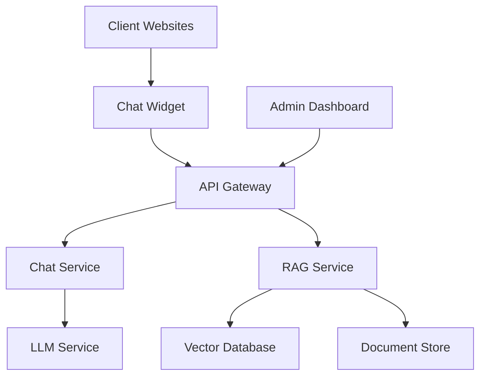

# Technical Requirements

## System Architecture

### High-Level Architecture


### RAG Implementation
1. **Document Processing Pipeline**
   - Web scraping for PsychScene Hub articles
   - Course catalog integration from Academy
   - Document chunking and preprocessing
   - Metadata extraction and tagging
   - Vector embedding generation

2. **Retrieval System**
   - Hybrid search (keyword + semantic)
   - Context window management
   - Relevance scoring
   - Source filtering
   - Result ranking

3. **Generation System**
   - Prompt engineering
   - Context injection
   - Response formatting
   - Source attribution
   - Safety checks

## Technology Stack

### Frontend
- **Framework**: Next.js 14+ with App Router
- **UI Library**: Tailwind CSS + Headless UI
- **State Management**: React Query
- **Chat UI**: Custom implementation with React
- **Styling**: Tailwind CSS + CSS Modules

### Backend
- **Runtime**: Node.js 20+
- **Framework**: Next.js API Routes
- **API Gateway**: Next.js Edge Runtime
- **Database**: Supabase (PostgreSQL)
- **Vector Database**: Pinecone
- **Caching**: Redis
- **Queue System**: Bull

### AI/ML
- **LLM**: GPT-4 Turbo
- **Embedding Model**: OpenAI text-embedding-3-small
- **Text Processing**: LangChain.js
- **Vector Operations**: Pinecone SDK

### Infrastructure
- **Hosting**: Vercel
- **CDN**: Vercel Edge Network
- **Monitoring**: Sentry
- **Logging**: DataDog
- **CI/CD**: GitHub Actions

## Data Ingestion Pipeline

### Article Processing
1. **Crawler Service**
   ```typescript
   interface CrawlerConfig {
     baseUrl: string;
     selectors: {
       article: string;
       title: string;
       content: string;
       metadata: string;
     };
     rateLimit: number;
   }
   ```

2. **Processing Steps**
   - HTML cleaning and normalization
   - Content extraction
   - Metadata parsing
   - Chunking (500-1000 tokens)
   - Embedding generation
   - Vector storage

### Course Integration
1. **API Integration**
   ```typescript
   interface CourseData {
     id: string;
     title: string;
     description: string;
     duration: number;
     topics: string[];
     prerequisites: string[];
     level: string;
     metadata: Record<string, any>;
   }
   ```

2. **Sync Process**
   - Periodic course catalog sync
   - Delta updates
   - Version control
   - Validation checks

## Database Schema

### Supabase Schema
```sql
-- Users table
CREATE TABLE users (
  id UUID PRIMARY KEY DEFAULT uuid_generate_v4(),
  email TEXT UNIQUE NOT NULL,
  created_at TIMESTAMP WITH TIME ZONE DEFAULT NOW(),
  last_login TIMESTAMP WITH TIME ZONE,
  metadata JSONB
);

-- Chat sessions
CREATE TABLE chat_sessions (
  id UUID PRIMARY KEY DEFAULT uuid_generate_v4(),
  user_id UUID REFERENCES users(id),
  created_at TIMESTAMP WITH TIME ZONE DEFAULT NOW(),
  updated_at TIMESTAMP WITH TIME ZONE DEFAULT NOW(),
  metadata JSONB
);

-- Messages
CREATE TABLE messages (
  id UUID PRIMARY KEY DEFAULT uuid_generate_v4(),
  session_id UUID REFERENCES chat_sessions(id),
  role TEXT NOT NULL,
  content TEXT NOT NULL,
  created_at TIMESTAMP WITH TIME ZONE DEFAULT NOW(),
  metadata JSONB
);

-- Article references
CREATE TABLE article_references (
  id UUID PRIMARY KEY DEFAULT uuid_generate_v4(),
  message_id UUID REFERENCES messages(id),
  article_id TEXT NOT NULL,
  relevance_score FLOAT,
  created_at TIMESTAMP WITH TIME ZONE DEFAULT NOW()
);

-- Course recommendations
CREATE TABLE course_recommendations (
  id UUID PRIMARY KEY DEFAULT uuid_generate_v4(),
  message_id UUID REFERENCES messages(id),
  course_id TEXT NOT NULL,
  relevance_score FLOAT,
  created_at TIMESTAMP WITH TIME ZONE DEFAULT NOW()
);
```

### Vector Database Schema (Pinecone)
```typescript
interface VectorMetadata {
  id: string;
  type: 'article' | 'course';
  title: string;
  content: string;
  url: string;
  chunk_index: number;
  total_chunks: number;
  created_at: string;
  updated_at: string;
  metadata: Record<string, any>;
}
```

## API Design

### Chat Endpoints
```typescript
// POST /api/chat
interface ChatRequest {
  message: string;
  sessionId?: string;
  context?: {
    currentArticle?: string;
    userPreferences?: Record<string, any>;
  };
}

interface ChatResponse {
  message: string;
  sessionId: string;
  references: Array<{
    type: 'article' | 'course';
    id: string;
    title: string;
    relevance: number;
  }>;
  metadata: Record<string, any>;
}

// GET /api/chat/sessions
interface ChatSession {
  id: string;
  createdAt: string;
  updatedAt: string;
  messageCount: number;
  metadata: Record<string, any>;
}

// GET /api/chat/sessions/:id/messages
interface ChatMessage {
  id: string;
  role: 'user' | 'assistant';
  content: string;
  createdAt: string;
  references: Array<{
    type: 'article' | 'course';
    id: string;
    title: string;
  }>;
}
```

### Admin Endpoints
```typescript
// GET /api/admin/metrics
interface SystemMetrics {
  activeUsers: number;
  totalSessions: number;
  averageResponseTime: number;
  errorRate: number;
  usageStats: {
    articles: number;
    courses: number;
    tokens: number;
  };
}

// POST /api/admin/feedback
interface FeedbackRequest {
  sessionId: string;
  messageId: string;
  rating: number;
  comment?: string;
}
```

## Deployment & Infrastructure

### Environment Setup
```env
# Core Services
OPENAI_API_KEY=
PINECONE_API_KEY=
SUPABASE_URL=
SUPABASE_ANON_KEY=
REDIS_URL=

# Monitoring
SENTRY_DSN=
DATADOG_API_KEY=

# Feature Flags
ENABLE_ANALYTICS=
ENABLE_FEEDBACK=
```

### Deployment Pipeline
1. **Development**
   - Local development with Docker
   - Hot reloading
   - Mock services

2. **Staging**
   - Preview deployments
   - Integration testing
   - Performance testing

3. **Production**
   - Blue-green deployment
   - Automated rollback
   - Health checks

### Monitoring & Alerts
1. **Metrics**
   - Response times
   - Error rates
   - Usage patterns
   - Resource utilization

2. **Alerts**
   - High error rates
   - Slow response times
   - Service disruptions
   - Resource exhaustion

3. **Logging**
   - Structured logging
   - Error tracking
   - Audit trails
   - Performance profiling

## Security Considerations

### Authentication
- JWT-based authentication
- Role-based access control
- Session management
- Rate limiting

### Data Protection
- Encryption at rest
- TLS 1.3
- Data masking
- Access logging

### Compliance
- HIPAA requirements
- GDPR compliance
- Data retention
- Audit trails

## Performance Optimization

### Caching Strategy
- Redis for session data
- CDN for static assets
- Browser caching
- API response caching

### Scaling Strategy
- Horizontal scaling
- Load balancing
- Database sharding
- Queue management

### Resource Management
- Memory optimization
- Connection pooling
- Background jobs
- Resource cleanup 